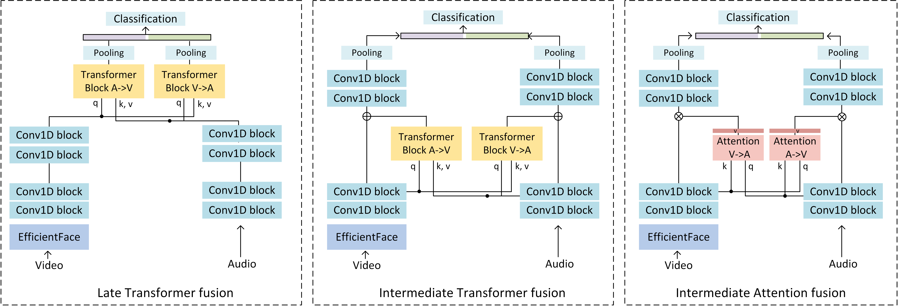

# Multimodal [audiovisual] emotion recognition


## About
This repository implements a multimodal network for emotion recognition from audio and video data following the paper "[Self-attention fusion for audiovisual emotion recognition with incomplete data]" accepted to ICPR 2022. We provide implementations for [Ravdess] dataset of speech and frontal face view data corresponding to 8 emotions: 01 = neutral, 02 = calm, 03 = happy, 04 = sad, 05 = angry, 06 = fearful, 07 = disgust, 08 = surprised. We provide implementations of three fusion variants ('late transformer', 'intermediate transformer', 'intermediate attention') and modality dropouts.
<p align="center">

</p>
<p align = "center">
Fusion blocks
</p>

## Dependencies
The code is tested with Python=3.9.5 and pytorch=1.9.0. To install required packages:
```
pip install -r requirements.txt
```

## Usage

#### Dataset preparation
For training on Ravdess, download data from [here](https://zenodo.org/record/1188976#.YkgJVijP2bh). You will need to download the files Video_Speech_Actor_[01-24].zip and Audio_Speech_Actors_01-24.zip. The directory should be organized as follows:
```
RAVDESS
└───ACTOR01
│   │  01-01-01-01-01-01-01.mp4
│   │  01-01-01-01-01-02-01.mp4
│   │  ...
│   │  03-01-01-01-01-01-01.wav
│   │  03-01-01-01-01-02-01.wav
│   │  ...
└───ACTOR02
└───...
└───ACTOR24
```

Install face detection library:
```sh
pip install facenet-pytorch
```
or follow instructions in https://github.com/timesler/facenet-pytorch

Preprocessing scripts are located in ravdess_preprocessing/
Inside each of three scripts, specify the path (full path!) where you have downloaded the data.
Then run:
```python
cd ravdess_preprocessing
python extract_faces.py
python extract_audios.py
python create_annotations.py
```
*In extract_faces.py the face data will be saved as numpy arrays by defaults. You can specify save_avi=True inside tre script if you want to also save data as videos for visualization purposes.*

As a result you will have annotations.txt file that you can use further for training.

#### Training
For visual module weight initialization, download the pre-trained EfficientFace from [here](https://github.com/zengqunzhao/EfficientFace) under 'Pre-trained models'. In our experiments, we use the model pre-trained on AffectNet7, i.e., EfficientFace_Trained_on_AffectNet7.pth.tar. If you want to use a different one, download it and later specify the path in \-\-pretrain_path argument to main.py. Otherwise, you can ignore this step and train from scratch (although you will likely obtain lower performance).

For training, run:
```python
python main.py
```
You can optionally specify the following arguments:
* \-\-fusion [it | lt | ia] = modality fusion variant: intermediate transformer, late transformer, intermediate attention (default) (check the paper for details).
* \-\-mask [softhard | noise | nodropout ] = modality dropout variant. Default is softhard (check paper for details). 
* \-\-num_heads = specifies the number of heads to use in the fusion module.
* \-\-pretrain_path = path to EfficientFace pre-trained checkpoint.
* \-\-result_path = path where the results and trained models will be saved
* \-\-annotation_path = path to annotation file generated at previous step

By default, this will train the model, select the best iteration on validation set and report the performance on the test set (in [RESULT_PATH]/tes_set_bestval.txt). Other training parameters that can be adjusted are self-explanatory and can be seen from opts.py. The defaults are set to those used in the paper.

The codebase defaults to single-fold training, but supports multi-fold cross-validation, for that you might want to specify the annotation path for each fold separately in main.py. 

#### Testing
If you want to test previously trained model specify the --no_train and --no_val arguments as well as the path to the experiment folder containing the checkpoint:

```python
python main.py  --no_train --no_val --result_path [PATH_TO_CHECKPOINT_FOLDER]
```
#### Using your own data
For training on a different dataset: 
* create the dataset class in datasets/[yourdataset.py] and add it to the dataset builder in dataset.py. 
* specify appropriate --sample_size (image dimension, e.g. 224), --sample_duration (temporal dimension of image sequnce, e.g. 15), --n_classes corresponding to your dataset

## Citation
If you use our work, please cite as:
```bibtex
@article{chumachenko2022self,
  title={Self-attention fusion for audiovisual emotion recognition with incomplete data},
  author={Chumachenko, Kateryna and Iosifidis, Alexandros and Gabbouj, Moncef},
  journal={arXiv preprint arXiv:2201.11095},
  year={2022}
}
```

## References
This work uses EfficientFace from https://github.com/zengqunzhao/EfficientFace . Please consider citing their paper "Robust Lightweight Facial Expression Recognition Network with Label Distribution Training". Thanks to @zengqunzhao for providing the implementation and the pretrained model for EfficientFace!

Parts of the training pipeline code are modified from https://github.com/okankop/Efficient-3DCNNs under MIT license and parts of fusion implementation is based on timm library https://github.com/rwightman/pytorch-image-models under Apache 2.0 license. For data preprocessing we used https://github.com/timesler/facenet-pytorch

   [Self-attention fusion for audiovisual emotion recognition with incomplete data]: <https://arxiv.org/abs/2201.11095>
   [Ravdess]: <https://smartlaboratory.org/ravdess/>
